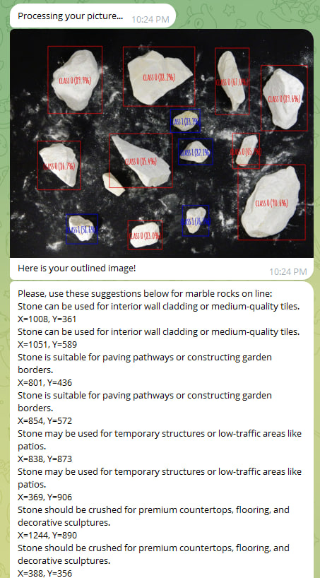

# MarbleQualityBot

**MarbleQualityBot** is a backend application for a Telegram chatbot that processes images sent by users. It includes services for:
- Object rendering on images.
- Annotating these images.
- Calculating object centers.
- Leveraging an expert system with a built-in knowledge base about marble quality to provide recommendations for marble usage.

---

## **Tech Stack**

The project is built using the following technologies:
- **.NET 7.0**: Core framework for building the application.
- **MediatR**: For implementing the mediator pattern and handling CQRS.
- **Telegram.Bot**: For interacting with the Telegram Bot API.
- **dotNetRdf**: For working with RDF data.
- **SixLabors.ImageSharp.Drawing**: For drawing and image manipulation.

### **Testing and Mocking**
- **Moq**: For creating mock objects during testing.
- **xUnit**: For writing and running unit tests.

---

## **Integrations**

The application integrates with:
- **Roboflow API**: For advanced image recognition and processing.
- **Telegram API**: To receive and send messages and images through Telegram.

---

## **Build, Run, and Test**

### **Build**

```bash
dotnet build .\src\MarbleQualityBot.API\MarbleQualityBot.API.csproj
```

### **Run**

```bash
dotnet run .\src\MarbleQualityBot.API\MarbleQualityBot.API.csproj
```

### **Tests**

```bash
dotnet test .\tests\MarbleQualityBot.Core.Tests\MarbleQualityBot.Core.Tests.csproj
```

### **Example**

